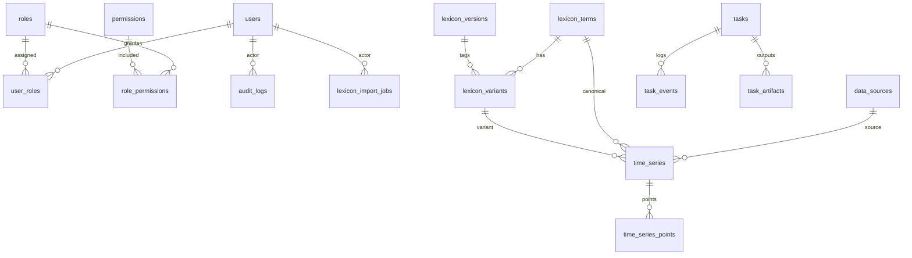

# DB Schema (M2)

## Scope

- Milestone: `M2`
- DB: MySQL 8.0 (`misspell`)
- Init file: `misspelling-platform/db/init/001_schema.sql`
- Init mode: idempotent (`CREATE TABLE IF NOT EXISTS` + `INSERT IGNORE`)

## Table Count (M2)

- Total tables created by `001_schema.sql`: `16`
- Meets M2 requirement: `>= 10`

## Initialization

- `docker compose` now includes a one-shot `db-init` service.
- `db-init` runs `mysql ... < /schema/001_schema.sql` after `mysql` is healthy.
- `api` and `worker` wait for `db-init` `service_completed_successfully`.

## Table List

### System / RBAC / Audit

1. `users`
- Purpose: user accounts (normal/admin flags)
- PK: `id`
- Key indexes: `UNIQUE(username)`, `idx_users_active`
- Relations: referenced by `user_roles`, `audit_logs`, `lexicon_import_jobs`
- Current usage (M2): schema + seed-ready, API usage deferred

2. `roles`
- Purpose: role definitions (e.g., `admin`, `user`)
- PK: `id`
- Key indexes: `UNIQUE(name)`
- Relations: referenced by `user_roles`, `role_permissions`
- Current usage (M2): seeded by `001_schema.sql`

3. `permissions`
- Purpose: permission codes (RBAC capability points)
- PK: `id`
- Key indexes: `UNIQUE(code)`
- Relations: referenced by `role_permissions`
- Current usage (M2): seeded by `001_schema.sql`

4. `user_roles`
- Purpose: many-to-many mapping between users and roles
- PK: composite (`user_id`, `role_id`)
- Key indexes: `idx_user_roles_role`
- Relations: FK -> `users(id)`, FK -> `roles(id)`
- Current usage (M2): schema ready

5. `role_permissions`
- Purpose: many-to-many mapping between roles and permissions
- PK: composite (`role_id`, `permission_id`)
- Key indexes: `idx_role_permissions_perm`
- Relations: FK -> `roles(id)`, FK -> `permissions(id)`
- Current usage (M2): `admin` seeded to all permissions via `INSERT IGNORE ... SELECT`

6. `audit_logs`
- Purpose: audit trail for admin/task/lexicon actions
- PK: `id`
- Key indexes: `idx_audit_action`, `idx_audit_created`
- Relations: FK -> `users(id)` (`actor_user_id`, `SET NULL`)
- Current usage (M2): schema ready (event writing deferred)

### Data Sources / Lexicon

7. `data_sources`
- Purpose: external source registry (GDELT, GBNC, etc.)
- PK: `id`
- Key indexes: `UNIQUE(name)`, `idx_data_sources_enabled`
- Relations: referenced by `time_series`
- Current usage (M2): seeded with `GDELT`, `GBNC`

8. `lexicon_versions`
- Purpose: lexicon versioning / release markers
- PK: `id`
- Key indexes: `UNIQUE(name)`, `idx_lexicon_versions_active`
- Relations: referenced by `lexicon_variants`
- Current usage (M2): seeded with `v1-initial`

9. `lexicon_terms`
- Purpose: canonical terms
- PK: `id`
- Key indexes: `UNIQUE(canonical)`, `idx_lexicon_terms_category`
- Relations: referenced by `lexicon_variants`, `time_series`
- Current usage (M2): schema ready

10. `lexicon_variants`
- Purpose: misspelling / spelling variants per canonical term
- PK: `id`
- Key indexes: `uq_lexicon_variants_term_variant`, `idx_lexicon_variants_term`, `idx_lexicon_variants_version`
- Relations: FK -> `lexicon_terms(id)`, FK -> `lexicon_versions(id)`
- Current usage (M2): schema ready

11. `lexicon_import_jobs`
- Purpose: batch import / crawl / generated lexicon job tracking
- PK: `id`
- Key indexes: `idx_lexicon_import_jobs_status`
- Relations: FK -> `users(id)` (`actor_user_id`, `SET NULL`)
- Current usage (M2): schema ready

### Time Series Storage

12. `time_series`
- Purpose: frequency series metadata (source, granularity, window, preprocessing meta)
- PK: `id`
- Key indexes: `idx_time_series_term`, `idx_time_series_variant`, `idx_time_series_source`, `idx_time_series_granularity`
- Relations: FK -> `lexicon_terms`, `lexicon_variants`, `data_sources`
- Current usage (M2): schema ready for M3 data pipeline

13. `time_series_points`
- Purpose: point values for a `time_series`
- PK: composite (`series_id`, `t`)
- Key indexes: `idx_time_series_points_t`
- Relations: FK -> `time_series(id)` (`CASCADE`)
- Current usage (M2): schema ready for M3 data pipeline

### Task System / Traceability / Artifacts

14. `tasks`
- Purpose: task master table (existing runtime table, now formalized in schema)
- PK: `id`
- Key indexes: `UNIQUE(task_id)`, `idx_tasks_status`, `idx_tasks_type`, `idx_tasks_created`
- Relations: referenced by `task_events`, `task_artifacts` via `task_id`
- Current usage (M2): actively used by existing API + Celery worker (`word-analysis`, `simulation-run`)

15. `task_events`
- Purpose: task progress/events/log timeline
- PK: `id`
- Key indexes: `idx_task_events_task`, `idx_task_events_ts`, `idx_task_events_level`
- Relations: FK -> `tasks(task_id)` (`CASCADE`)
- Current usage (M2): schema ready (event writes deferred to later milestone)

16. `task_artifacts`
- Purpose: persisted artifact metadata (csv/png/html/pdf/json)
- PK: `id`
- Key indexes: `uq_task_artifacts_unique`, `idx_task_artifacts_task`, `idx_task_artifacts_kind`
- Relations: FK -> `tasks(task_id)` (`CASCADE`)
- Current usage (M2): schema ready (runtime artifact metadata insert deferred to later milestone)

## Relationship Sketch (Mermaid)

## Compatibility Notes (M2)

- `tasks` table columns remain compatible with existing API/worker code.
- `scripts/check.ps1` now checks for formal schema first and reports table count.
- `tasks` fallback bootstrap remains as temporary compatibility path and is skipped when schema is present.
