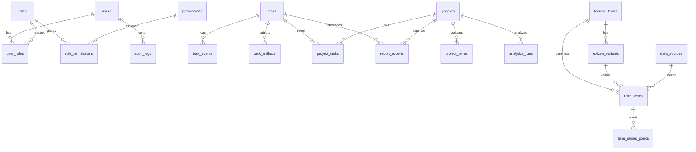

# DB_SCHEMA.md (M12)

## Initialization

- `db/init/001_schema.sql` (base 16 tables)
- `db/init/002_m11_multitenant.sql` (owner columns/indexes)
- `db/init/003_m12_enterprise.sql` (projects/reports/analytics/task lineage)

`docker-compose.yml` runs one-shot `db-init` after MySQL health.

## Current Table Count

- Total tables: `21` (verified by `scripts/check.ps1`)

## Table Groups

### 1) Identity / RBAC / Audit

- `users`
- `roles`
- `permissions`
- `user_roles`
- `role_permissions`
- `audit_logs`

### 2) Task Pipeline

- `tasks` (`owner_user_id`, `parent_task_id`, `deleted_at`)
- `task_events`
- `task_artifacts` (`owner_user_id`)

### 3) Lexicon / Variants / Import

- `lexicon_versions`
- `lexicon_terms` (`owner_user_id`)
- `lexicon_variants` (`owner_user_id`)
- `lexicon_import_jobs`

### 4) Data Sources / Time Series

- `data_sources`
- `time_series` (`owner_user_id`)
- `time_series_points`

### 5) Enterprise M12 Extensions

- `projects`
- `project_terms`
- `project_tasks`
- `report_exports`
- `analytics_runs`

## Ownership and Isolation

`owner_user_id` is used for guest/user/admin scope control:

- guest => `owner_user_id IS NULL`
- user => `owner_user_id = self`
- admin => unrestricted (`scope=all`) or scoped (`scope=guest`)

Applied to tasks/series/artifacts/lexicon/report resources.

## Core Relationships

```mermaid
erDiagram
  users ||--o{ user_roles : has
  roles ||--o{ user_roles : mapped
  roles ||--o{ role_permissions : grants
  permissions ||--o{ role_permissions : assigned
  users ||--o{ audit_logs : actor

  tasks ||--o{ task_events : logs
  tasks ||--o{ task_artifacts : outputs
  tasks ||--o{ project_tasks : linked
  tasks ||--o{ report_exports : referenced

  projects ||--o{ project_terms : contains
  projects ||--o{ project_tasks : links
  projects ||--o{ analytics_runs : analyzed
  projects ||--o{ report_exports : exported

  lexicon_terms ||--o{ lexicon_variants : has
  lexicon_terms ||--o{ time_series : canonical
  lexicon_variants ||--o{ time_series : variant
  data_sources ||--o{ time_series : source
  time_series ||--o{ time_series_points : points
```

## Notes

- Existing task/file API contracts remain compatible.
- New tables are used by API/services (not placeholder-only).
